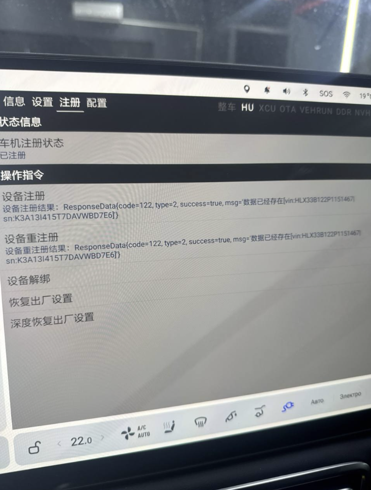

# LiAuto_Network_Scanner
Программа предназначена для проверки доступности серверов обновления(OTA) и управления(APP) автомобилей Lixiang.
---
Перед началом использования изучите файл [User_Manual](User_Manual.md)\
Пример файла отчета можно скачть и посмотреть в браузере [Мегафон без](scan_report_2026-02-09_01-58-10.pdf) и [Мегафон с ним](scan_report_2026-02-09_02-00-52(NVP).pdf) \
Пример, когда не возможно получить мастер аакаунт (МА) и машина не управляется с мобильного приложения, а в инженерном меню вот такие данные: \

* **Разработчик:** Владимир (SVG)
* **Telegram:** [@svg62](https://t.me/svg62)
* **Если вам нравится приложение,вы можете поддержать разработчика:**
[**Оставить донат**](https://pay.cloudtips.ru/p/939f128d)
---
Created with ❤️ for Li Auto community

<a href="https://www.star-history.com/#SVG62/LiAuto_Network_Scanner&type=date&legend=bottom-right">
 <picture>
   <source media="(prefers-color-scheme: dark)" srcset="https://api.star-history.com/svg?repos=SVG62/LiAuto_Network_Scanner&type=date&theme=dark&legend=bottom-right" />
   <source media="(prefers-color-scheme: light)" srcset="https://api.star-history.com/svg?repos=SVG62/LiAuto_Network_Scanner&type=date&legend=bottom-right" />
   
 </picture>
</a>
